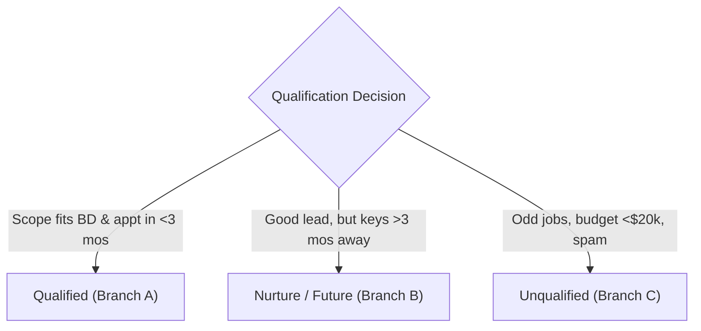
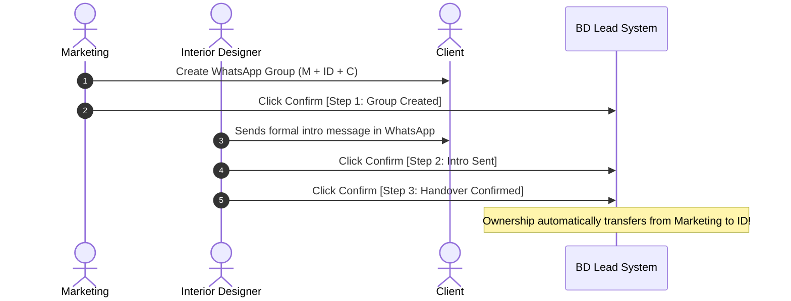

# Marketing Operational Guide — BD Lead System

The official, click-by-click operating manual for the marketing team at **By Design Works Singapore**.

> **THE GOLDEN RULE TO REMEMBER**
> Every open lead in the system must always have **an Owner, a Next Action, and a Due Date**.
> The system enforces this in software: no stage change, response, or meeting can be saved without a defined forward commitment. That is how no client is ever forgotten.

---

## Table of Contents

- [1. System Layout & Screen Anatomy](#1-system-layout--screen-anatomy)
  - [A. The Navigation Header](#a-the-navigation-header)
  - [B. Dashboard (`/`)](#b-dashboard-)
  - [C. My Day (`/my-day`) — Your Daily Cockpit](#c-my-day-my-day--your-daily-cockpit)
  - [D. Leads List (`/leads`)](#d-leads-list-leads)
  - [E. Lead Detail Page (`/leads/[id]`)](#e-lead-detail-page-leadsid)
- [2. Daily Operating Routine](#2-daily-operating-routine)
  - [Morning Protocol (First 15 Minutes)](#morning-protocol-first-15-minutes)
  - [Midday & Continuous Protocol](#midday--continuous-protocol)
- [3. Click-by-Click Workflows: Lead Ingestion & Qualification](#3-click-by-click-workflows-lead-ingestion--qualification)
  - [Workflow 1: Capturing a New Manual Enquiry (WhatsApp, Instagram, Walk-in, Referral)](#workflow-1-capturing-a-new-manual-enquiry-whatsapp-instagram-walk-in-referral)
  - [Workflow 2: Automatic Website Enquiries (Intake Form)](#workflow-2-automatic-website-enquiries-intake-form)
  - [Workflow 3: Logging Your First Response (Stopping the SLA Clock)](#workflow-3-logging-your-first-response-stopping-the-sla-clock)
  - [Workflow 4: Chasing Unanswered Qualification Questions (3-Chase SOP)](#workflow-4-chasing-unanswered-qualification-questions-3-chase-sop)
  - [Workflow 5: Qualifying the Lead (Qualified, Nurture, or Unqualified)](#workflow-5-qualifying-the-lead-qualified-nurture-or-unqualified)
- [4. Click-by-Click Workflows: Appointments & ID Handover](#4-click-by-click-workflows-appointments--id-handover)
  - [Workflow 6: Booking Meeting 1 (Consultation Appointment)](#workflow-6-booking-meeting-1-consultation-appointment)
  - [Workflow 7: Assigning an Interior Designer (ID)](#workflow-7-assigning-an-interior-designer-id)
  - [Workflow 8: The 3-Step Handover Checklist (Transferring Ownership)](#workflow-8-the-3-step-handover-checklist-transferring-ownership)
  - [Workflow 9: Rescheduling, Cancellations, and No-Shows](#workflow-9-rescheduling-cancellations-and-no-shows)
- [5. Click-by-Click Workflows: Pipeline Progression & Lead Management](#5-click-by-click-workflows-pipeline-progression--lead-management)
  - [Workflow 10: Updating or Rescheduling Next Actions](#workflow-10-updating-or-rescheduling-next-actions)
  - [Workflow 11: Working Nurture Leads & Logging Re-contact Attempts](#workflow-11-working-nurture-leads--logging-re-contact-attempts)
  - [Workflow 12: Closing a Lead as Lost](#workflow-12-closing-a-lead-as-lost)
  - [Workflow 13: Reopening a Closed or Dormant Lead](#workflow-13-reopening-a-closed-or-dormant-lead)
  - [Workflow 14: Handling Repeat Clients with a Second Property](#workflow-14-handling-repeat-clients-with-a-second-property)
  - [Workflow 15: Setting Do Not Contact (DNC / Unsubscribe)](#workflow-15-setting-do-not-contact-dnc--unsubscribe)
- [6. Marketing Reports & Campaign Attribution](#6-marketing-reports--campaign-attribution)
  - [Workflow 16: Reviewing Acquisition Channel Quality & Conversion](#workflow-16-reviewing-acquisition-channel-quality--conversion)
  - [Workflow 17: Reviewing Attribution Discrepancies (Tracked vs. Stated)](#workflow-17-reviewing-attribution-discrepancies-tracked-vs-stated)
- [7. Operational Reference & Policy](#7-operational-reference--policy)
  - [A. Qualification Decision Matrix](#a-qualification-decision-matrix)
  - [B. Standard Dropdown Reason Lists](#b-standard-dropdown-reason-lists)
  - [C. Permissions & Role Boundaries (What Marketing Cannot Do)](#c-permissions--role-boundaries-what-marketing-cannot-do)
  - [D. Troubleshooting Error Messages](#d-troubleshooting-error-messages)
  - [E. System Glossary](#e-system-glossary)

---

# 1. System Layout & Screen Anatomy

### A. The Navigation Header
The navigation bar is sticky at the top of every screen:

| UI Element | Location | Click Action / Purpose |
|---|---|---|
| **BY DESIGN / LEAD SYSTEM** | Far Left | Navigates to your personal homepage (`/` for marketing/admin, `/my-day` for IDs). |
| **Dashboard** | Left Nav | Opens the macro management overview of team pipeline and health. |
| **My Day** | Left Nav | Opens your personal daily to-do queue. Displays a **red numeric badge** if you have overdue items or leads missing next actions. |
| **Leads** | Left Nav | Opens the master directory of all enquiries with full filtering and search. |
| **Reports** | Left Nav | Opens source conversion, cohort performance, and attribution reports. |
| **Settings** | Left Nav | Operational settings, SLA thresholds, and team sync (visible to Managers/Admins). |
| **+ New Lead** | Far Right (Gold button) | Opens the manual lead creation screen (`/leads/new`). |
| **[Your Name] · [ROLE]** | Far Right | Shows your current authenticated name and access level. |
| **Sign out** | Far Right | Securely ends your Google session. |

---

### B. Dashboard (`/`)
The executive summary screen displaying lead flow and pipeline integrity:
- **6 Key Metrics Tiles:**
  - `New today`: Inbound count since midnight.
  - `New this week`: Inbound count for the current calendar week.
  - `Awaiting reply`: Leads where marketing has not sent the first reply (amber if > 0). Click to view.
  - `SLA breached`: Leads that exceeded the 1-hour response SLA (red if > 0). Click to view.
  - `Signed`: Projects signed to date (green). Click to view.
  - `Nurture`: Active nurture leads parked for future re-contact. Click to view.
- **Needs Attention Card:** Live exception list. Any dot with **Red** indicates a critical breach (SLA expired, no next action, overdue follow-up). **Amber** indicates impending risks (handover pending, nurture due). Clicking any line takes you directly to the filtered leads.
- **Pipeline Progression Bar:** Visual distribution of active leads across all stages (`New` → `Contacting` → `Qualified` → `Appt` → `Consult` → `Proposal` → `Closing`). Alerts if leads are stuck >14 days.
- **Upcoming Appointments Card:** Upcoming showroom consultations and site visits over the next 3 days.
- **Staff Workload Table:** Active, overdue, appointment, proposal, and conversion numbers broken down by team member.

---

### C. My Day (`/my-day`) — Your Daily Cockpit
The screen where every team member spends their workday. Leads are strictly sorted by urgency:
1. **Next 3 days:** Client appointments you are attending or responsible for.
2. **Overdue (Red tag):** Follow-ups past your promised due date. Fix these first.
3. **No next action (Red tag):** Leads missing a forward commitment. Fix immediately.
4. **Awaiting your first reply (Amber tag):** Fresh enquiries waiting for initial contact. The 1-hour SLA clock is ticking.
5. **Handover not confirmed (Amber tag):** Leads assigned to an ID where the 3-step WhatsApp handover is incomplete.
6. **Due today (Plain tag):** Actions scheduled for today.

---

### D. Leads List (`/leads`)
The full search directory:
- **Search Bar (`q`):** Searches across Client Name, Lead Code (`BD-YYMM-NNN`), Mobile Number (`+65...`), and Property Name.
- **Filters:** Stage dropdown, Owner dropdown, and Status/Attention dropdown.
- **Quick-Filter Pills:** `Open only`, `Mine`, and stage chips (`New`, `Contacting`, `Qualified`, `Appt`, `Consult`, `Proposal`, `Closing`).
- **Severity Stripes:** The leftmost edge of each row flashes **Red** for critical attention or **Amber** for warning.

---

### E. Lead Detail Page (`/leads/[id]`)
The workspace for a single lead, divided into two distinct columns:

```
┌──────────────────────────────────────────────┬────────────────────────────────────────────┐
│ LEFT COLUMN: ACTIONS (Stage-Aware Cards)     │ RIGHT COLUMN: THE RECORD (Permanent Info)  │
├──────────────────────────────────────────────┼────────────────────────────────────────────┤
│ • Top Header: Name, Stage Chip, SLA Strip    │ • Client Details Card (Contacts, Property) │
│ • First Response Card (if unreplied)         │ • Below-Threshold Override Log (if any)    │
│ • Qualification Card (if unbudgeted)         │ • Attribution Card (Tracked vs Client Said)│
│ • ID Assignment & Handover (if qualified)    │ • Other Projects for this Client           │
│ • Appointments Card (Book & manage M1/M2/M3) │ • Completed Meetings Summary               │
│ • Nurture / Reopen / Close Cards             │ • Ownership Reassignment (Manager only)    │
│ • Next Action Override Card                  │ • Audit Trail & Activity History           │
└──────────────────────────────────────────────┴────────────────────────────────────────────┘
```

---

# 2. Daily Operating Routine

### Morning Protocol (First 15 Minutes)
1. Sign in via Google Workspace (`@bydesignworks.com`).
2. Click **My Day** in the top navigation.
3. Check the red badge on the **My Day** tab:
   - **Queue 1 — Awaiting your first reply:** Respond immediately to any client who messaged overnight or over the weekend.
   - **Queue 2 — Overdue:** Complete the overdue follow-up or update the commitment date ([Workflow 10](#workflow-10-updating-or-rescheduling-next-actions)).
   - **Queue 3 — Handover not confirmed:** Check if the ID created the WhatsApp group; chase if overdue ([Workflow 8](#workflow-8-the-3-step-handover-checklist-transferring-ownership)).
   - **Queue 4 — Next 3 days:** Ensure appointments for today and tomorrow have showroom slots booked and IDs confirmed.

### Midday & Continuous Protocol
- Keep **My Day** open.
- When an enquiry arrives via WhatsApp / Instagram, capture it immediately ([Workflow 1](#workflow-1-capturing-a-new-manual-enquiry-whatsapp-instagram-walk-in-referral)).
- Reply within **1 working hour** to protect the company SLA ([Workflow 3](#workflow-3-logging-your-first-response-stopping-the-sla-clock)).
- You are 100% up-to-date when **My Day** shows the clean banner:
  > *"Nothing is late and nothing is due. Every lead you own has an owner, a stage, a next action and a due date."*

---

# 3. Click-by-Click Workflows: Lead Ingestion & Qualification

---

## Workflow 1: Capturing a New Manual Enquiry (WhatsApp, Instagram, Walk-in, Referral)

**When to use:** A client contacts BD directly via WhatsApp, Instagram DM, phone call, or showroom walk-in.

### Step 1: Duplicate & Previous Client Pre-Check
1. Click the gold **+ New lead** button at the top right of the screen.
2. Under the top section **Check for an existing client first**:
   - In the input field **Check for an existing client first**, enter the client's Singapore phone number (e.g. `91234567` or `+6591234567`), OR enter their **Email**, OR enter their **@instagram** handle.
   - Click the **Check** button.
3. **Review the outcome:**
   - **If a card titled "Possible existing client" appears:**
     - The client has worked with or contacted BD before.
     - *If they are enquiring about a BRAND NEW property:* Click the button **New project for this client** (see [Workflow 14](#workflow-14-handling-repeat-clients-with-a-second-property)).
     - *If they are messaging about an existing or closed project:* Click on their existing lead link to reopen it (see [Workflow 13](#workflow-13-reopening-a-closed-or-dormant-lead)).
   - **If no existing client appears:**
     - Proceed directly to Step 2 below.

### Step 2: Complete Lead Details
Scroll down to the **Lead details** card and fill in the fields:

1. **Client name** *(Required text)*: Type the client's full name (e.g., `Rachel Tan`).
2. **Mobile / WhatsApp** *(Text)*: Enter phone number in E.164 format (e.g., `+6591234567`).
3. **Email** *(Email input)*: Enter email address if provided (e.g., `rachel.tan@gmail.com`).
4. **Instagram handle** *(Text)*: Enter their IG username (e.g., `@racheltan_home`).
5. **Original source — cannot be changed later** *(Required dropdown)*:
   - Select the true origin where the client discovered BD:
     - `WhatsApp / Direct WhatsApp`
     - `Instagram / BD Main Account`
     - `Instagram / SeanBD`
     - `Website / Website Form`
     - `Existing Database / Past Client`
     - `Referral / Past Client Referral`
     - `Referral / Other Referral`
   > ⚠️ **CRITICAL:** Original source is permanent and locked in code. If an Instagram lead contacts you on WhatsApp, the Source is `Instagram / SeanBD`, and the Channel is `WhatsApp`. Never select WhatsApp as the source if they came from an ad or Instagram.
6. **Current conversation channel** *(Text)*: Type where you are currently conversing (e.g., `WhatsApp`).
7. **Property / project** *(Text)*: Enter the development name (e.g., `Punggol Northshore BTO`).
8. **Category** *(Dropdown)*: Select one: `BTO`, `HDB Resale`, `New Condo`, `Resale Condo`, `Landed`, or `Commercial`.
9. **Unit** *(Dropdown)*: Select one: `3-room`, `4-room`, `5-room`, `Executive`, or `Other`.
10. **Location** *(Text)*: Enter estate or neighborhood (e.g., `Punggol`).
11. **When did the client message?** *(Datetime-local)*:
    - **Leave blank** if the enquiry arrived just now. The system automatically stamps the current minute.
    - If you are entering an enquiry that came in earlier (e.g., late last night), click the date picker and set the exact past date and time.
    > ℹ️ *The SLA calculates response time from the client's message time, not when you typed the form.*
12. **Owner** *(Dropdown)*: Defaults to your name. Leave as yourself.

### Step 3: Save & Confirm
1. Click the primary button **Create lead** at the bottom of the card.
2. **Visual Confirmation:**
   - The browser redirects to `/leads/[id]`.
   - The header displays the client's name, lead code (e.g., `BD-2609-001`), and property name.
   - The stage chip shows **NEW**.
   - The top SLA strip shows: `"Client messaged [Time] · No reply yet — 0 working min elapsed"`.
   - **Next action** displays: `"Respond and ask qualification questions"`, due in **1 working hour**.
3. **Next Action:** Send your reply message to the client on WhatsApp/IG, then complete [Workflow 3](#workflow-3-logging-your-first-response-stopping-the-sla-clock).

---

## Workflow 2: Automatic Website Enquiries (Intake Form)

**When to use:** A homeowner fills out the cost estimator or consultation form on `bydesignworks.com`.

### What the system does automatically:
- The website intake API creates the contact and opportunity instantly.
- Source is locked to `Website / Website Form`.
- Campaign parameters, UTM source, and landing page are logged in the **Attribution** card.
- The lead is automatically assigned to the designated Intake Owner.
- Stage is set to **NEW**, with next action `"Respond and ask qualification questions"` due within 1 working hour.

### Your Click-by-Click Action:
1. Click **My Day** in the top navigation.
2. Scroll to the card **Awaiting your first reply** (or click the **Awaiting reply** tile on the Dashboard).
3. Click on the client's name.
4. On the lead detail page:
   - Check the right column under **Client** to see property type, location, and submitted budget.
   - Scroll down the right column to **History**: Read the full message or calculator submission notes.
5. Reach out to the client via WhatsApp or phone call.
6. Proceed immediately to [Workflow 3](#workflow-3-logging-your-first-response-stopping-the-sla-clock).

---

## Workflow 3: Logging Your First Response (Stopping the SLA Clock)

**When to use:** You have sent your first reply to the client on WhatsApp, Instagram DM, or email.

> ⏱ **SLA Target:** Within **1 working hour** (Operating window: Monday–Saturday, 9:30 AM – 6:30 PM, excluding Singapore Public Holidays).

### Click-by-Click Instructions:
1. Open the client's lead page (`/leads/[id]`).
2. Locate the top card in the left column: **First response** *(hint: "Stops the SLA clock and sets the next step")*.
3. Review the pre-filled fields:
   - **Next action** input: Pre-filled with `"Chase qualification answers"`.
   - **Due** input: Pre-filled with tomorrow at 10:00 AM Singapore time.
   - *(Optional)* If the client replied immediately while on the phone, you can change the Next action text to `"Review floor plan"` or adjust the due date.
4. Click the primary button **Mark responded**.

### Visual Confirmation:
- The **First response** card disappears from the screen.
- In the top header, the stage chip transitions from **NEW** to **CONTACTING**.
- The SLA bar in the header turns **Green**: `"Replied in X working min"`. *(If past 60 working minutes, it turns Red with an SLA breach notice).*
- The **Qualification** card now appears in the left column.
- The lead moves out of **Awaiting your first reply** in **My Day**.

---

## Workflow 4: Chasing Unanswered Qualification Questions (3-Chase SOP)

**When to use:** You replied to the client asking the 6 qualification questions, but the client has not answered.

### The 3-Chase Schedule:
- **Chase 1:** ~24 hours after enquiry.
- **Chase 2:** ~2 to 3 days after enquiry.
- **Chase 3 (Final):** ~7 days after enquiry.

### Click-by-Click Instructions (After sending each chase message on WhatsApp):
1. Open the client's lead page.
2. Scroll to the bottom of the left column to the **Next action** card.
3. In the input **What happens next**, enter the updated status:
   - For Chase 1: `Follow-up 1 sent — awaiting scope & budget`
   - For Chase 2: `Follow-up 2 sent — awaiting key collection date`
   - For Chase 3: `Follow-up 3 sent — final check-in`
4. In the input **Due**, select the next follow-up date and time (e.g. 2 days later at 10:00 AM).
5. Click the button **Set**.

### Visual Confirmation:
- Top header **Next action** and **Due** update immediately.
- The activity is recorded in chronological **History** at the bottom right.

### If Still No Response After Chase 3:
Do NOT delete the lead. Do NOT leave it to sit overdue. Move the lead to **Nurture / Future** (see [Workflow 5, Branch B](#branch-b-decision--nurture--future)) with the note: `"No response after 3 follow-ups"`.

---

## Workflow 5: Qualifying the Lead (Qualified, Nurture, or Unqualified)

**When to use:** The client provides answers to the qualification questions:
1. *Property category & unit type*
2. *Renovation scope (areas to renovate)*
3. *Renovation budget*
4. *Key collection timing*
5. *Target renovation start date*
6. *Target ID confirmation timeline*

### Step 1: Open the Form
1. Open the lead detail page.
2. In the left column, locate the **Qualification** card *(hint: "Qualified, Nurture or Unqualified — each has exactly one exit")*.

### Step 2: Fill in Client Qualification Data
1. **Budget (S$)** *(Number input)*: Enter numbers only, without commas (e.g. `55000`).
2. **Key collection** *(Text input)*: Enter status (e.g., `Collected` or `Q3 2027` or `2027-04`).
3. **Renovation scope** *(Text input)*: Describe the work (e.g., `Full home: 2 baths, kitchen carpentry, hacking, vinyl flooring`).
4. **Target ID confirmation** *(Text input)*: Enter decision timeline (e.g., `Within 2 weeks` or `By next month`).
5. **Price sensitive / quote matching** *(Checkbox)*:
   - Tick this box if the client is actively collecting 4+ quotations or explicitly requested price matching.
   - *Note: This is a visibility flag for the designer; it does NOT disqualify the client.*

---

### Step 3: Choose the Qualification Decision (Select One Branch)



---

### Branch A: Decision = "Qualified"
Use when scope is viable, budget is realistic, and client wants an ID within ~3 months.

1. Set dropdown **Decision** to `Qualified`.
2. **Handle Below-Threshold Budgets (if Budget < S$30,000):**
   - If the entered budget is below S$30,000, an **amber warning box** appears automatically:
     > *"Below the S$30,000 threshold. Qualifying anyway is allowed — it just gets recorded..."*
   - In the input field **Override reason**, you **MUST** provide a business justification (e.g., `Referral from signed client Mr. Tan; simple styling package`).
3. **Exit Fields:**
   - **Next action**: Pre-filled with `"Book Meeting 1"`.
   - **Due**: Pre-filled with tomorrow at 10:00 AM.
4. Click the primary button **Save qualification**.
5. **Visual Confirmation:**
   - Stage chip turns green/accent: **QUALIFIED**.
   - The card **ID assignment and handover** immediately appears in the left column.
   - The right column **Client** card displays all saved qualification figures and the override note.
6. **Next Action:** Proceed to [Workflow 6](#workflow-6-booking-meeting-1-consultation-appointment) to book Meeting 1.

---

### Branch B: Decision = "Nurture / Future"
Use when the client is genuine, but keys are >3 months away, or they are just browsing and not ready to meet an ID.

1. Set dropdown **Decision** to `Nurture / Future`.
2. The form replaces the action fields with the **Recontact** exit fields:
   - **Re-contact on** *(Datetime-local, Required)*: Pick a future check-in date (e.g. 2 months prior to their key collection date).
   - **What are we waiting for?** *(Text input)*: Enter the future milestone (e.g., `Key collection in March 2027; re-contact January 2027`).
3. Click the primary button **Save qualification**.
4. **Visual Confirmation:**
   - Stage chip updates to amber: **NURTURE**.
   - Top header displays: `"Next action: Re-contact on [Date] · Waiting for: [Note]"`.
   - The lead is parked cleanly out of your daily urgent queue until that date arrives.

---

### Branch C: Decision = "Unqualified"
Use when the project is not a fit (repairs, handyman jobs, budget <$20k with no scope, aggressive price-hackers, spam).

1. Set dropdown **Decision** to `Unqualified`.
2. The form replaces the action fields with the **Close** exit fields:
   - **Unqualified reason** *(Required dropdown)*: Select the exact reason:
     - `Budget too low`
     - `Scope too small`
     - `Odd job / repair`
     - `Unrealistic budget`
     - `Project not suitable`
     - `Price shopping / quotation matching`
     - `Timeline too far away`
     - `Client not serious`
     - `Spam / vendor`
     - `Other`
   - **Note** *(Text input)*: Mandatory if you selected `Other`. Enter concise details.
3. Click the primary button **Save qualification**.
4. **Visual Confirmation:**
   - Stage chip turns gray: **UNQUALIFIED**.
   - Top header displays: `"Outcome: Unqualified — [Reason]"`.
   - All active follow-up tasks are closed.

---

# 4. Click-by-Click Workflows: Appointments & ID Handover

---

## Workflow 6: Booking Meeting 1 (Consultation Appointment)

**When to use:** A qualified client agrees to a showroom consultation, site inspection, or video call.

### Click-by-Click Instructions:
1. Open the qualified lead page.
2. In the left column, locate the card **Appointments** *(hint: "Meeting count is tracked; the number of meetings is not fixed")*.
3. At the bottom of the card, find the **Book meeting 1** row:
   - **Book meeting 1** (`starts_at`): Click the datetime picker and select the agreed meeting date and time (e.g., `2026-09-24T14:30`).
   - **Location** (`location`): Type the venue:
     - `BD Showroom, Oxley BizHub #06-20`
     - `Client Unit / Site Inspection`
     - `Google Meet / Zoom`
   - **With** (`assigned_user_id`):
     - If you have already picked the designer, select their name from the dropdown.
     - If not decided yet, leave as `Unassigned`.
4. Click the button **Book**.

### Visual Confirmation:
- The appointment appears in the list as:
  `Meeting 1 · [Date & Time] · [Location] · [Designer Name] · SCHEDULED`.
- Top header stage chip updates to **APPT** (Appointment Booked).
- Top header **Next action** automatically updates to: `Meeting 1 · [Date & Time]`.
- The appointment appears on the **Dashboard** under **Upcoming appointments**.

> ⚠️ **CRITICAL POLICY:** Booking the appointment does **NOT** transfer lead ownership to the ID. Marketing remains the owner until the 3-step handover is confirmed in [Workflow 8](#workflow-8-the-3-step-handover-checklist-transferring-ownership).

---

## Workflow 7: Assigning an Interior Designer (ID)

**When to use:** You have determined which designer will take the project based on availability, property type experience, and workload.

### Click-by-Click Instructions:
1. Open the lead detail page.
2. In the left column, locate the card **ID assignment and handover** *(hint: "Ownership transfers only on the third checkpoint")*.
3. In the form row:
   - **Assign ID** (`id_user`): Select the designer from the dropdown list of active designers.
   - **Why this ID** (`reason`): Enter a brief note (e.g., `Experienced in resale landed; available Thursday evening`).
4. Click the button **Assign** (or **Reassign** if changing an existing ID).

### Visual Confirmation:
- Top header **Assigned ID** updates to show the designer's name.
- The 3-Step Handover Checklist appears below:
  1. `[1] WhatsApp group created`
  2. `[2] Introduction sent`
  3. `[3] Handover confirmed — ownership moves to the ID`
- A blue alert box displays the **Handover Deadline**:
  > *"Due [Date/Time] (in X hours) — whichever came first: 24 working hours after assignment, or 12 hours before the appointment."*
- The lead now appears in your **My Day** under **Handover not confirmed**.

---

## Workflow 8: The 3-Step Handover Checklist (Transferring Ownership)

**When to use:** Immediately following ID assignment. Handover ensures zero lead leakage between Marketing and Sales.



---

### Step 1: Create the WhatsApp Group
1. **In WhatsApp (Phone or Desktop App):**
   - Create a new WhatsApp Group.
   - Add: **The Client**, **The Assigned ID**, and **Yourself**.
   - Standard Group Subject: `BD | [Client Name] | [Property Name]` (e.g., `BD | Rachel Ng | Punggol BTO`).
2. **In BD Lead System:**
   - On the lead page under **ID assignment and handover**:
   - Beside `1. WhatsApp group created`, click the button **Confirm**.
   - ✓ A green checkmark `✓` appears with the current timestamp.

---

### Step 2: Introduction Sent
1. **In WhatsApp:**
   - The Assigned ID posts the formal introduction message in the group, introducing themselves and confirming the scheduled appointment.
2. **In BD Lead System:**
   - Beside `2. Introduction sent`, click the button **Confirm**.
   - *(The ID usually clicks this in their login, but Marketing can click to confirm).*
   - ✓ A green checkmark `✓` appears with the current timestamp.

---

### Step 3: Handover Confirmed (Ownership Transfer)
1. **In BD Lead System:**
   - Beside `3. Handover confirmed — ownership moves to the ID`, click the button **Confirm**.
2. **Visual Confirmation:**
   - All 3 items display green checkmarks `✓`.
   - In the top header, **Owner** changes from your name to the **Assigned ID**.
   - The lead immediately disappears from your **My Day → Handover not confirmed** queue.
   - The handover is officially complete. The ID now owns all meeting updates and sales progression.

---

## Workflow 9: Rescheduling, Cancellations, and No-Shows

**When to use:** The client cancels, postpones, or fails to attend the scheduled consultation.

### Click-by-Click Instructions:
1. Open the lead detail page.
2. In the left column, locate the **Appointments** card.
3. Under the scheduled meeting row, find the form **"Meeting 1 did not happen"**:
   - Dropdown **Meeting 1 did not happen** (`status`): Choose one:
     - `No-show` — Client failed to appear without notice.
     - `Cancelled by client` — Client cancelled in advance.
     - `Rescheduled` — Client requested a different date.
4. Review the compulsory exit fields:
   - **Next action**: Enter your follow-up action (e.g., `Call client to reschedule showroom appointment`).
   - **Due**: Select date and time for follow-up (e.g., tomorrow at 11:00 AM).
5. Click the button **Record outcome**.

### Visual Confirmation:
- The appointment badge changes to `NO-SHOW` (red), `CANCELLED` (gray), or `RESCHEDULED` (gray).
- If cancelled with >24h notice, notice duration is displayed (e.g. `48h notice`) to safeguard attendance metrics.
- Top header stage chip automatically reverts from `APPT` to **QUALIFIED** (ensures pipeline accuracy).
- Top header **Next action** displays your rebooking task.
- When a new date is fixed, return to [Workflow 6](#workflow-6-booking-meeting-1-consultation-appointment) to book the new slot.

---

# 5. Click-by-Click Workflows: Pipeline Progression & Lead Management

---

## Workflow 10: Updating or Rescheduling Next Actions

**When to use:** A client asks for more time, requirements change, or a promised deadline moves.

> ⚠️ **RULE:** An open lead can never sit without a Next Action and Due Date.

### Click-by-Click Instructions:
1. Open the lead detail page.
2. Scroll to the bottom of the left column to the **Next action** card *(hint: "An open lead is never allowed to sit without one")*.
3. In the field **What happens next** (`action`): Enter the specific task (e.g., `Check if client obtained HDB floor plan`).
4. In the field **Due** (`due`): Pick the exact date and time.
5. Click the button **Set**.

### Visual Confirmation:
- Top header **Next action** and **Due** fields update instantly.
- The new commitment is reflected across **My Day** and **Dashboard**.

---

## Workflow 11: Working Nurture Leads & Logging Re-contact Attempts

**When to use:** A parked Nurture lead arrives at its re-contact date and appears in **My Day** or **Dashboard → Needs attention → Nurture due**.

### Step 1: Re-engage the Client
Contact the client via WhatsApp: `"Hi Rachel, following up on your Punggol BTO from BD Works. Have your keys been released?"`

### Step 2: Choose Outcome Based on Reply

#### Case A: Client is Ready to Proceed
1. Scroll to the **Reopen** card on the lead detail page.
2. In the input **Next action**, type: `Schedule Meeting 1 consultation`.
3. Set the **Due** date/time.
4. Click the primary button **Reopen lead**.
5. ✓ The stage returns to **QUALIFIED** (or **CONTACTING**).
6. Proceed to [Workflow 6](#workflow-6-booking-meeting-1-consultation-appointment) to book Meeting 1.

#### Case B: Client is Still Waiting (Not Ready Yet)
1. In the **Nurture** card *(shows "Attempt X of 3 before going dormant")*:
2. In the field **Next re-contact**, select the next future date (e.g. 2 months later).
3. Click the button **Log re-contact attempt**.
4. ✓ The attempt counter increments (e.g. `Attempt 2 of 3`). The lead is parked until the new date.

#### Case C: Client Does Not Reply (After 3 Attempts)
1. If this is the 3rd silent attempt, leave the field **Next re-contact** **BLANK**.
2. Click the button **Log re-contact attempt**.
3. ✓ The lead stage updates to **DORMANT**:
   - It is removed from daily queues.
   - It is NOT deleted; all history, notes, and contact details remain fully searchable.

---

## Workflow 12: Closing a Lead as Lost

**When to use:** The client confirms they selected another interior firm, dropped renovation plans, or ceased communication.

### Click-by-Click Instructions:
1. Open the lead detail page.
2. Locate the card **Close this lead** in the left column.
3. In the left sub-form **Lost**:
   - **Lost reason** (`reason`, *Required dropdown*): Select one:
     - `No response`
     - `Chose another ID`
     - `Price`
     - `Design preference`
     - `Timeline`
     - `Location/project issue`
     - `Client not serious`
     - `Other`
   - **Note** (`note`): Enter specific competitor name or reasons (mandatory if `Other` is selected).
4. **Post-Proposal Loss Approval (D-08 Rule):**
   - *If the lead is at `Proposal Presented` or `Closing / Revisions`:*
     - Substantial design hours have been invested.
     - A checkbox **Confirm this loss as manager** appears.
     - Only Marketing Managers or Admins can check this box and execute the loss. If you are standard marketing, alert your manager to approve the closure.
5. Click the danger button **Mark lost**.

### Visual Confirmation:
- Stage chip changes to gray: **LOST**.
- Top header **Outcome** displays: `Lost — [Reason]`.
- Future follow-up reminders are cancelled.

---

## Workflow 13: Reopening a Closed or Dormant Lead

**When to use:** A client previously marked as **Lost**, **Unqualified**, or **Dormant** contacts BD again regarding the **SAME property**.

### Click-by-Click Instructions:
1. Click **Leads** in the top navigation.
2. Enter the client's name or mobile number in the search bar and press **Filter**.
3. Click the client's name to open their lead page.
4. Locate the card **Reopen** *(hint: "The client came back (§24)")*.
5. Complete the mandatory exit fields:
   - **Next action**: Type the immediate task (e.g., `Client messaged again — re-confirm updated floor plan`).
   - **Due**: Set to today/now.
6. Click the primary button **Reopen lead**.

### Visual Confirmation:
- The lead stage changes back to **CONTACTING** (or **QUALIFIED**).
- A badge appears in the header: **REOPENED ×1**.
- The SLA response clock starts fresh.
- All historical notes, meetings, and original marketing attribution are completely preserved.

---

## Workflow 14: Handling Repeat Clients with a Second Property

**When to use:** A past client (whether signed, lost, or completed) contacts BD to renovate a **DIFFERENT property** (e.g., renovated their BTO in 2024; now bought a resale condo).

> ℹ️ **Concept:** *Contact ≠ Opportunity.* One human contact can have multiple distinct property opportunities.

### Click-by-Click Instructions:
1. Click the gold **+ New lead** button (top right).
2. In **Check for an existing client first**, enter their phone or email and click **Check**.
3. In the card **Possible existing client**, locate their name.
4. On the right side of their row, click the button **New project for this client**.

### Visual Confirmation:
- A new lead detail screen opens immediately.
- Header subtitle displays: `... · opportunity #2 for this client`.
- In the right column, a card appears: **Other projects for this client**, linking directly to their previous properties.
- Client contact information is synced without creating duplicate contacts.

---

## Workflow 15: Setting Do Not Contact (DNC / Unsubscribe)

**When to use:** A client explicitly requests to stop receiving calls, messages, or marketing communications.

### Click-by-Click Instructions:
1. Open the lead detail page.
2. In the right column, locate the **Client** card.
3. At the bottom of the card, locate the DNC bar:
   - In the input field **Reason**, enter the context (e.g., `Client requested no further WhatsApp messages`).
   - Click the danger button **Do not contact**.

### Visual Confirmation:
- A red uppercase badge appears in the header: **DO NOT CONTACT**.
- The contact is blocked across all queues, reports, and reminder engines.
- The record is preserved to prevent any staff member or ad import from re-adding them accidentally.
- *(To reverse if requested by client: Click the button **Lift do-not-contact**).*

---

# 6. Marketing Reports & Campaign Attribution

---

## Workflow 16: Reviewing Acquisition Channel Quality & Conversion

**When to use:** Evaluating ad spend efficiency, conversion rates, and channel ROI.

### Click-by-Click Instructions:
1. Click **Reports** in the top navigation.
2. Examine the top table: **Conversion by original source**:
   - **Source:** Acquisition channel (never overwritten by conversation channel).
   - **Leads:** Total volume captured.
   - **Qualified / Qual rate:** Percentage of leads that met BD project criteria.
   - **Appts / Attended:** Booking rate and attendance rate (attendance excludes cancellations made with >24h notice).
   - **Signed / Sign rate:** Contracts won and conversion rate from qualified leads.
   - **Avg value / Value:** Average contract size and total signed contract revenue.
3. Examine the second card: **Lead-month cohorts**:
   - Performance grouped strictly by the **month the lead entered the system**, regardless of how many months later it signed.

---

## Workflow 17: Reviewing Attribution Discrepancies (Tracked vs. Stated)

**When to use:** Checking whether tracked UTM sources match what clients verbally state.

### Background:
During **Meeting 1**, the system forces the ID to ask two mandatory verbal questions:
1. *"How did you hear about By Design Works?"*
2. *"What made you reach out to us right now?"*

### Checking Inconsistencies:
1. Open any lead that has completed Meeting 1.
2. In the right column, check the **Attribution** card:
   - **Tracked source:** Shows original digital origin (e.g., `Website / Website Form`).
   - **Client said:** Shows what the client told the designer in person (e.g., `Saw Sean's reel on Instagram`).
3. If an amber alert box appears:
   > *"Tracked as Website, but the client credits Instagram. Worth watching across the source report."*
   Take note for marketing campaign budget allocation.

---

# 7. Operational Reference & Policy

---

## A. Qualification Decision Matrix

| Dimension | Qualified | Nurture / Future | Unqualified |
|---|---|---|---|
| **Timeline to Appoint ID** | Within 3 months | > 3 months away | Unknown / Indefinite |
| **Key Collection** | Keys collected or within 6 months | Keys in > 6 months / 2027+ | Far future or commercial lease |
| **Budget Threshold** | ≥ S$30,000 *(or <$30k with manager override)* | Any viable future budget | Under S$20,000 with large scope |
| **Scope of Work** | Meaningful renovation (full unit, kitchen + 2 baths) | Full renovation planned later | Handyman work, single room painting, door repairs |
| **Client Seriousness** | Actively researching, compares 2–3 IDs | Gathering early ideas | Demands immediate quote matching on competitor BOQ |

---

## B. Standard Dropdown Reason Lists

### 1. Unqualified Reasons
- `Budget too low` — Project funds insufficient for BD minimum standard.
- `Scope too small` — Partial work not meeting project threshold.
- `Odd job / repair` — Maintenance, repairs, minor handyman items.
- `Unrealistic budget` — Scope heavily mismatches client's budget expectations.
- `Project not suitable` — Commercial or technical requirements outside BD capabilities.
- `Price shopping / quotation matching` — Pure price-hunter unwilling to engage in design consultation.
- `Timeline too far away` — Renovation years away with no firm key date.
- `Client not serious` — Unresponsive or non-committal.
- `Spam / vendor` — Marketing solicitations or incorrect numbers.
- `Other` *(Mandatory written note required)*.

### 2. Lost Reasons
- `No response` — Client stopped replying post-qualification or post-meeting.
- `Chose another ID` — Selected another design firm.
- `Price` — BD proposal exceeded client's budget.
- `Design preference` — Selected a competitor offering a different design aesthetic.
- `Timeline` — BD schedule could not meet client's handover target.
- `Location/project issue` — Site constraints or management restrictions.
- `Client not serious` — Withdrew from renovation entirely.
- `Other` *(Mandatory written note required)*.

---

## C. Permissions & Role Boundaries (What Marketing Cannot Do)

| Action | Allowed for Marketing? | Who Must Do It |
|---|---|---|
| Create lead / Log first response | ✅ Yes | Marketing |
| Qualify lead (Qualified / Nurture / Unqualified) | ✅ Yes | Marketing |
| Book Meeting 1 & Assign ID | ✅ Yes | Marketing |
| Confirm 3-Step Handover | ✅ Yes *(Steps 1 & 2)* | Marketing & ID |
| Update Meeting 1/2/3 outcomes | ❌ No | Assigned Interior Designer |
| Reassign Lead Owner to another staff | ❌ No | Marketing Manager / Admin |
| Close a lead as Lost **before** Proposal | ✅ Yes | Marketing or ID |
| Close a lead as Lost **after** Proposal | ❌ No *(D-08)* | Marketing Manager / Admin |
| Edit System SLA & Working Hours | ❌ No | Admin |
| Change Role Permissions | ❌ No | Admin |

---

## D. Troubleshooting Error Messages

When an action fails, a **red banner appears at the top of the screen**. No data is saved until the error is corrected:

| Error Message | Exact Cause | Exact Fix |
|---|---|---|
| *"Next action cannot be blank"* | You clicked Save without typing a task description. | Type the next step in the **Next action** field. |
| *"Next action needs a due date"* | You omitted the due date or left the time incomplete. | Pick both a date and time in the **Due** picker. |
| *"A nurture lead needs a re-contact date"* | Decision was set to Nurture but no date was picked. | Select a future date in **Re-contact on**. |
| *"Budget is below the S$30,000 threshold…override reason required"* | You marked a <$30k lead as Qualified without justification. | Type a valid reason into the amber **Override reason** box. |
| *"Reason 'Other' requires a note"* | You selected `Other` as the lost/unqualified reason. | Fill in the **Note** input field explaining the circumstance. |
| *"Losses from Proposal Presented onward need a marketing manager's confirmation"* | You tried to close a lead after design proposal presentation. | Have your Marketing Manager log in to tick the confirmation box and close. |
| *"Create the WhatsApp group and send the introduction before confirming handover"* | You clicked Checkpoint 3 before completing Checkpoints 1 and 2. | Click **Confirm** on Step 1 and Step 2 first. |
| *"Choose an active interior designer"* | Attempted to assign an ID using an inactive or non-ID user account. | Select an active designer from the dropdown. |
| *"That could not be saved. Nothing was changed — please try again."* | Network interruption or invalid input combination. | Refresh the page and re-submit the form. |

---

## E. System Glossary

- **Lead / Opportunity:** A single renovation enquiry for a specific property.
- **Contact:** The human client record. Can own multiple property opportunities over time.
- **Original Source:** The acquisition channel where the client first found BD (immutable, permanent).
- **Conversation Channel:** The communication tool currently in use (e.g. WhatsApp, phone).
- **SLA (Service Level Agreement):** The requirement to reply to a new inbound enquiry within 1 working hour.
- **Working Hours:** Mon–Sat, 9:30 AM – 6:30 PM SGT, excluding Singapore Public Holidays.
- **Handover:** The formal 3-checkpoint protocol transferring lead responsibility from Marketing to an ID.
- **Dormant:** A nurture lead that failed to respond after 3 consecutive check-ins. Archived without deletion.
- **DNC (Do Not Contact):** Permanent suppression of a contact upon their request.
